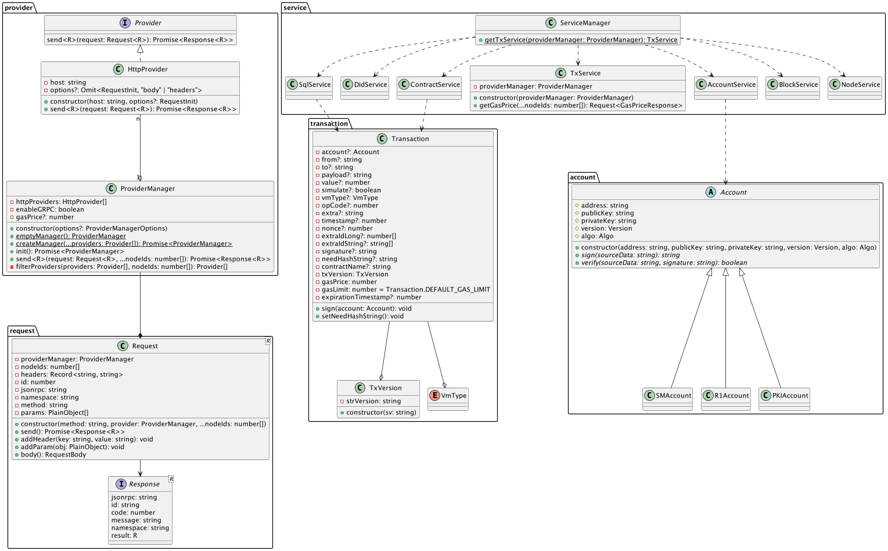

# JS SDK

[](http://commitizen.github.io/cz-cli/)

`@hyperchain/jssdk` 是一个能与 Hyperchain 直接通信的 JavaScript 库。

## Feature

- **便于使用**：开发者无需关注 Hyperchain 内部的具体实现，即可编写出与"链"交互的应用；
- **功能对齐**：API 全面与 LITE SDK 对齐，提供相对统一的使用方式，减少使用者的学习成本；
- **兼容平台**：兼容 Node.js 和浏览器两套运行环境；
- **类型提示**：提供全套的 TypeScript 类型注解；
- **详尽文档**：完善的使用文档，帮助开发者快速全面了解和使用 JS SDK；

## Prerequisites

- Node version 15.0.0 or higher;

## Architecture



`@hyperchain/jssdk` 主要分为两个大模块——网络通信模块（如上图的左侧）、服务提供模块（如上图的右侧）。

### 网络通信模块

“网络通信模块”封装底层网络通信，子模块如下：

- provider 子模块：向上提供基础的网络通信能力；
- request 子模块：统一“请求”和“响应”的逻辑；

### 服务提供模块

”服务提供模块”封装请求参数，以 Service 的形式对外提供，给开发者提供统一的调用方式，子模块如下：

- account 子模块：结合加密算法和哈希算法生成账户，提供签名、验签功能；
- transaction 子模块：对“交易体”进行统一的封装；
- service 子模块：请求参数封装，直接对外提供调用链上方法的服务，主要有以下 7 个服务：
  1. Account Service：为用户提供创建、查询 Account 服务；
  2. Contract Service：部署合约、调用合约、管理合约；
  3. SQL Service：管理数据库、SQL 调用；
  4. DID Service：提供分布式数字身份体系（DID）的操作；
  5. Tx Service：查询交易信息，可查询内容与 LiteSDK 对齐；
  6. Block Service：查询 Block 信息，可查询内容与 LiteSDK 对齐；
  7. Node Service：查询 Node 信息，可查询内容与 LiteSDK 对齐；

## Directory

```
.
├── src
│   ├── common                   // 通用工具
|   ├── error                    // 错误类型
│   ├── provider                 // 网络通信模块 / provider 模块
│   ├── request                  // 网络通信模块 / reqeust 模块
│   ├── account                  // 服务提供模块 / account 模块
│   ├── transaction              // 服务提供模块 / transaction 模块
│   ├── service                  // 服务提供模块 / service 模块
│   └── index.ts
├── test                         // 单测
├── docs                         // 文档
├── example                      // 示例
├── LICENSE
├── README.md
├── package.json
├── tsconfig.json
└── webpack.config.js
```

## Getting Started

### Documentation

You can find for more details, API, and other docs on [docs](https://docs.hyperchain.cn/docs/flato-solo/5.1-flato-sdk-litesdk).

### Example

You can find for complete code example on [example](./examples).

### Installation

```shell
npm install @hyperchain/jssdk --save
```

### Import

```typescript
import {
  Provider,
  ProviderManager,
  Transaction,
  ServiceManager
} from "@hyperchain/jssdk";
```

### Usage

##### 1. Build provider manager

```typescript
const httpProvider1 = new HttpProvider(1, "localhost:8081");

const providerManager = await ProviderManager.createManager({
  httpProviders: [httpProvider1]
});
```

##### 2. Build service

```typescript
const accountService = ServiceManager.getAccountService(providerManager);
const contractService = ServiceManager.getContractService(providerManager);
```

##### 3. Create account

```typescript
const account = accountService.genAccount(Algo.ECRAW);
```

##### 4. Build transaction

```typescript
const file: Buffer = fs.readFileSync(
  path.resolve(__dirname, "../resource/hvm-jar/credential-1.0-credential.jar")
);

const transaction = await new Transaction.HVMBuilder(
  account.getAddress(),
  providerManager
)
  .deploy(file)
  .then((builder) => builder.build());
transaction.sign(account);
```

##### 5. Get response

```typescript
const deployRequest = contractService.deploy(transaction);
const response = await deployRequest.send();
const deployHvmResult = await response.poll();
```

## Work locally

First, you should confirm that Node.js version is 15.0.0 or higher.

You can use [`n`](https://www.npmjs.com/package/n#n--interactively-manage-your-nodejs-versions) to manage your Node.js Versions.

### 1. Publish locally

You can use [`yalc`](https://github.com/wclr/yalc) to grab only files that should be published to NPM and puts them in a special global store (located, for example, in `~/.yalc`).

```
# in the root path of the project
npm i        # install dependencies
npm run link # publish locally
```

### 2. Add

You can use [`yalc`](https://github.com/wclr/yalc) to add `@hyperchain/jssdk` in your dependent project.

`yalc` will copy the current version from the store to your project's `.yalc` folder and inject a `file:.yalc/my-package` dependency into `package.json`.

```
# in your dependent project
npx yalc add @hyperchain/jssdk
```

Now, you can use `@hyperchain/jssdk` as a common npm package in your project.

For usage about `@hyperchain/jssdk`, please visit [Getting Started](#Getting-Started).

## Issue

If you have any suggestions or idea, please submit issue in this project!
